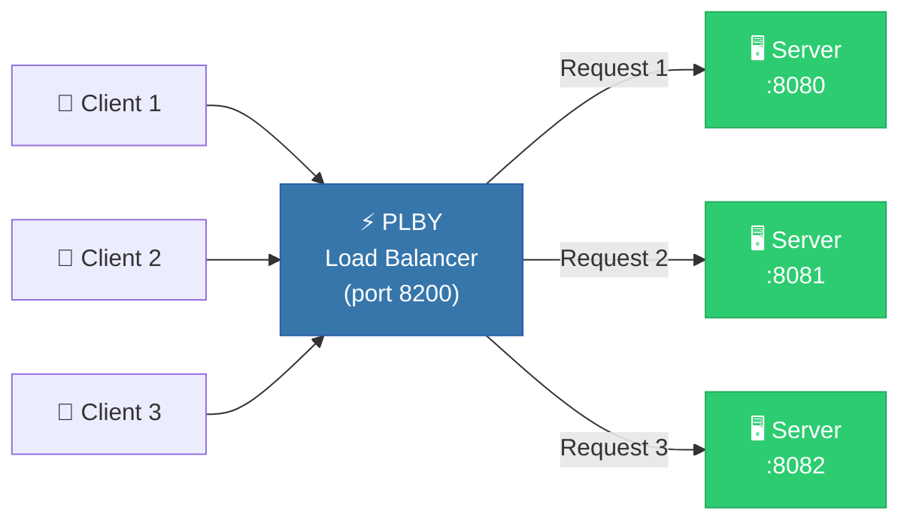

<div align="center">

# ⚡ PLBY — Python Load Balancer

### A lightweight TCP load balancer &amp; reverse proxy built from scratch in Python

[](https://github.com/suman1buie/PLBY/actions/workflows/pylint.yml)


<br/>


<br/>

> ⚠️ **Note:** This project is in an early stage and is intended for learning and experimentation purposes only.

</div>

---

## 📖 Table of Contents

- [Features](#-features)
- [Architecture](#-architecture)
- [Prerequisites](#-prerequisites)
- [Project Structure](#-project-structure)
- [Configuration](#%EF%B8%8F-configuration)
- [Setup & Running](#%EF%B8%8F-setup--running-the-project)
- [Expected Output](#-expected-output)
- [Future Improvements](#-future-improvements)
- [Contributing](#-contributing)

---

## 📌 Features

| Feature | Description |
|---------|-------------|
| 🔀 **Round Robin** | Distributes requests evenly across backend servers |
| 🔁 **TCP Reverse Proxy** | Transparently forwards client connections to backends |
| 🖥️ **Multi-Backend** | Supports multiple backend server instances |
| 📝 **TOML Config** | Simple, human-readable configuration via `config.toml` |
| 🧪 **Test Client** | Built-in client to verify load balancing behavior |
| 🧵 **Threaded** | Handles concurrent connections using thread pools |

---

## 🏗️ Architecture



---

## 🧰 Prerequisites

* **Python 3.11+** — required for the built-in `tomllib` module

```bash
# Verify your Python version
python3 --version
```

---

## 📁 Project Structure

```
PLBY/
├── 📄 config.toml          # Load balancer configuration
├── 🖥️ server.py             # Backend TCP server
├── 👤 client.py             # Test client for requests
└── 📂 src/
    ├── ⚡ loadbalancer.py   # TCP load balancer (reverse proxy)
    └── 📝 read_config.py    # TOML config parser
```

---

## ⚙️ Configuration

The load balancer is configured via `config.toml` in the project root:

```toml
[[server]]
listen = "0.0.0.0:8200"

[[server.forward]]
algorithm = "WRR"
backends = [
    { address = "127.0.0.1:8080" },
    { address = "127.0.0.1:8081" },
    { address = "127.0.0.1:8082" },
]
```

| Key | Description |
|-----|-------------|
| `listen` | Address and port the load balancer binds to |
| `algorithm` | Balancing algorithm (`WRR` — Weighted Round Robin) |
| `backends` | List of backend servers that receive forwarded traffic |

---

## ▶️ Setup & Running the Project

### 1️⃣ Clone the Repository

```bash
git clone https://github.com/suman1buie/PLBY.git
cd PLBY
```

### 2️⃣ Start Backend Servers

Open **three separate terminals** and start a server on each port:

```bash
python3 server.py 8080
python3 server.py 8081
python3 server.py 8082
```

### 3️⃣ Start the Load Balancer

```bash
cd src
python3 loadbalancer.py
```

### 4️⃣ Run the Client

```bash
python3 client.py
```

> **💡 Tip:** The client is currently hardcoded to connect to `localhost:8081`. To test through the load balancer, update the port in `client.py` to `8200`.

---

## ✅ Expected Output

When running through the load balancer, requests are distributed in Round Robin:

```
Hi from server 8080
Hi from server 8081
Hi from server 8082
Hi from server 8080
...
```

Each response comes from a different backend server in sequence.

---

## 🔒 Future Improvements

- [ ] 🛡️ Security enhancements (TLS support)
- [ ] 💓 Health checks for backend servers
- [ ] ⚖️ Weighted Round Robin with configurable weights
- [ ] 🔄 Fault tolerance & automatic failover
- [ ] 📊 Request metrics & monitoring dashboard
- [ ] 🌐 HTTP layer 7 routing support

---

## 🤝 Contributing

Contributions are welcome! Feel free to:

1. 🍴 Fork the repository
2. 🌿 Create a feature branch (`git checkout -b feature/amazing-feature`)
3. 💾 Commit your changes (`git commit -m 'Add amazing feature'`)
4. 📤 Push to the branch (`git push origin feature/amazing-feature`)
5. 🔃 Open a Pull Request

---

## 📄 Disclaimer

This project is for **educational purposes only** and is not production-ready.

---

<div align="center">

### ⭐ Star this repo if you find it useful!

Made with ❤️ by [suman1buie](https://github.com/suman1buie)

</div>
